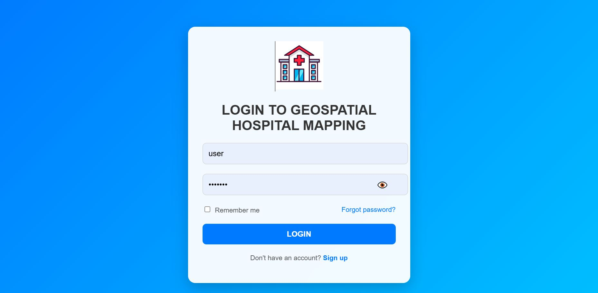
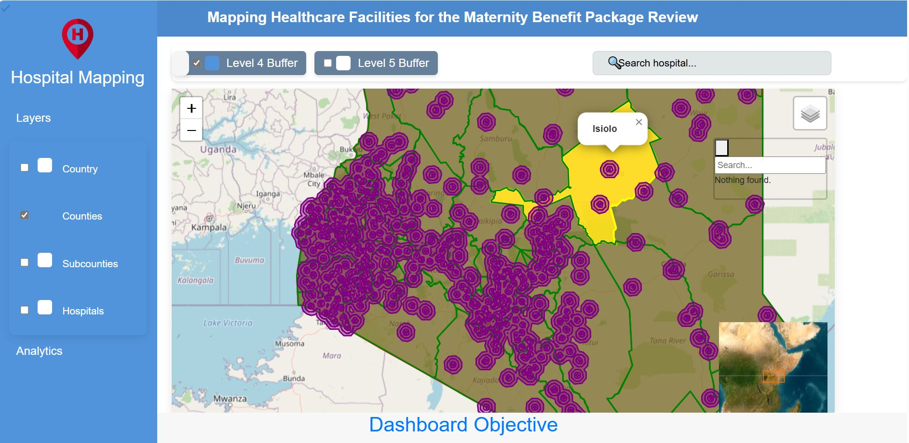
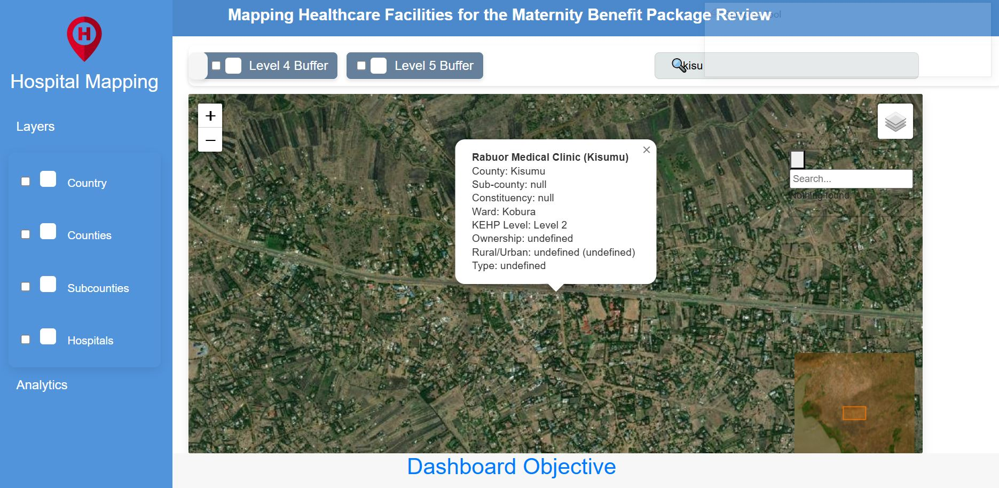
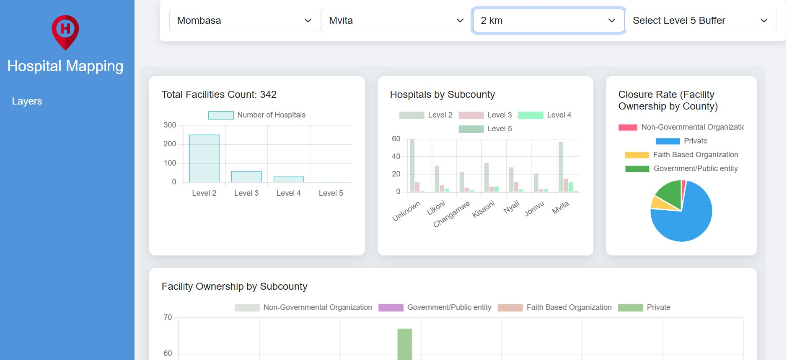
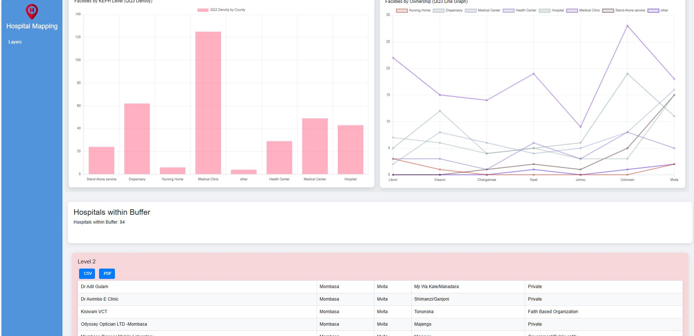

# Maternity Benefit Package Review

## Project Description
This project is part of the review for the Maternity Benefit Package. The goal is to analyze the spatial distribution of healthcare facilities and identify gaps in healthcare access based on facility levels. The key objectives include:

- Mapping all Level 5 facilities that do not have a Level 2, 3, or 4 facility within a 2km, 5km, 10km, or 15km radius.
- Mapping all Level 4 facilities that do not have a Level 2 or 3 facility within the same radii.
- Providing an interactive web map where users can:
  - View all hospitals and their buffer zones.
  - Toggle visibility of Level 2, 3, and 4 facilities within different radii.
  - Click on facilities to view details (e.g., level, ownership).
  - Download data as a CSV file.

    ## Screenshots of the output






## Technologies Used
- **Backend:** [Django](https://docs.djangoproject.com/en/5.1/), [Django REST Framework](https://www.django-rest-framework.org/), [Django GIS (PostGIS)](https://docs.djangoproject.com/en/5.1/ref/contrib/gis/)
- **Database:** [PostgreSQL](https://www.postgresql.org/) with [PostGIS](https://postgis.net/)
- **Frontend:** Interactive Web Map
- **Deployment:** [Docker](https://www.docker.com/), [Nginx](https://www.nginx.com/), [Gunicorn](https://gunicorn.org/)

## Project Structure
```
myproject/               # Main Django project directory
│   ├── models.py            # Database models
│   ├── views.py             # API views for fetching hospital and buffer data
│   ├── serializers.py       # Data serialization
│   ├── urls.py              # URL routing
│   ├── templates/           # Frontend templates
requirements.txt         # Dependencies
Dockerfile               # Docker setup
docker-compose.yml       # Docker Compose configuration
scripts/                 # Custom startup scripts
README.md                # Project documentation
```

## Installation and Setup
### Prerequisites
- [Docker & Docker Compose](https://www.docker.com/)
- [PostgreSQL with PostGIS extension](https://hub.docker.com/r/postgis/postgis/)
- [Python](https://www.python.org/)

### Running the Application
1. Clone the repository:
   ```sh
   git clone https://github.com/Straton12/Hospital_Maternity_Mapping.git
   ```
2. Create and Activate a Virtual Environment:
   ```sh
   python -m venv venv
   source venv/bin/activate
   cd myproject
   ```
3. Build and start the Docker containers:
   ```sh
   docker-compose up --build
   ```
4. Apply database migrations:
   ```sh
   docker exec -it django_app python manage.py migrate
   ```
5. Collect static files:
   ```sh
   docker exec -it django_app python manage.py collectstatic --noinput
   ```
6. Access the application at `http://localhost:8000`

## API Endpoints
- `/api/country/` - Get country boundary
- - `/api/counties/` - Get all counties boundaries
- - `/api/sub_counties/` - Get all sub_counties boundaries
- `/api/hospitals/` - Get all hospital facilities
- `/api/buffers/level4/` - Get Level 4 buffer zones
- `/api/buffers/level5/` - Get Level 5 buffer zones
- `/api/download/` - Download hospital data as CSV


## Additional Resources
- [QGIS Download](https://qgis.org/download/)
- [CSS Introduction](https://www.w3schools.com/css/css_intro.asp)
- [JavaScript Tutorials](https://www.w3schools.com/js/)
- [HTML Tutorials](https://www.w3schools.com/html/)

## Contributors
- **Straton**
- amodorastraton@gmail.com


